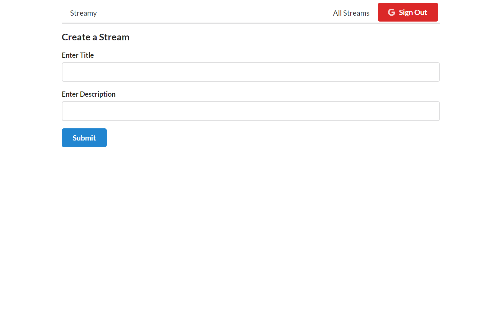
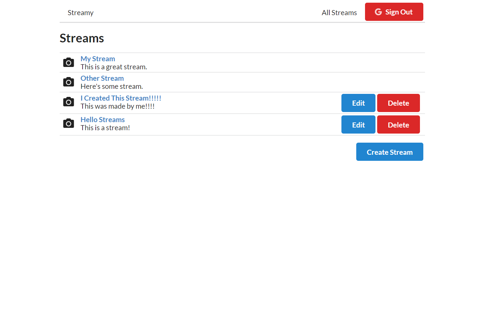

# Streamy - A Streaming Application

A streaming application that uses [NodeMediaServer](https://github.com/illuspas/Node-Media-Server) and [JSONServer](https://www.npmjs.com/package/json-server) that creates a simple platform where you can stream and display video.


# Installation
First clone the repo into the dir of your choosing:

 ```sh
 git clone https://github.com/Jared-Ivory/Streaming-Application.git
 ```

Next, for each directory (client, rtmpserver, stream-db) install NPM packages:
example: 
```sh
cd client
npm install`
```
To run the application change into the `Streaming-Application/client` directory and use:
```sh
npm run demo
```
## How to use
To create a stream:
Click on the 'Create Stream' button and provide a title and description:
> 

To view a stream:
Click on the top bar where it says 'All Streams' and click on the corresponding links to streams:
> 
*Note: the address bar contains the id of the selected stream when you go to view a stream*

To stream to the application:
By setting up your streaming service to stream to the server `rtmp://localhost/live` with the stream key being the ID created by using the application, (Click the stream and look at the id in the address bar), you can view the stream.
> 

## Created using
* [React](https://reactjs.org/) - Frontend Framework
* [NodeMediaServer](https://github.com/illuspas/Node-Media-Server) - Media Server 
* [JSONServer](https://www.npmjs.com/package/json-server) - Simple Database Server